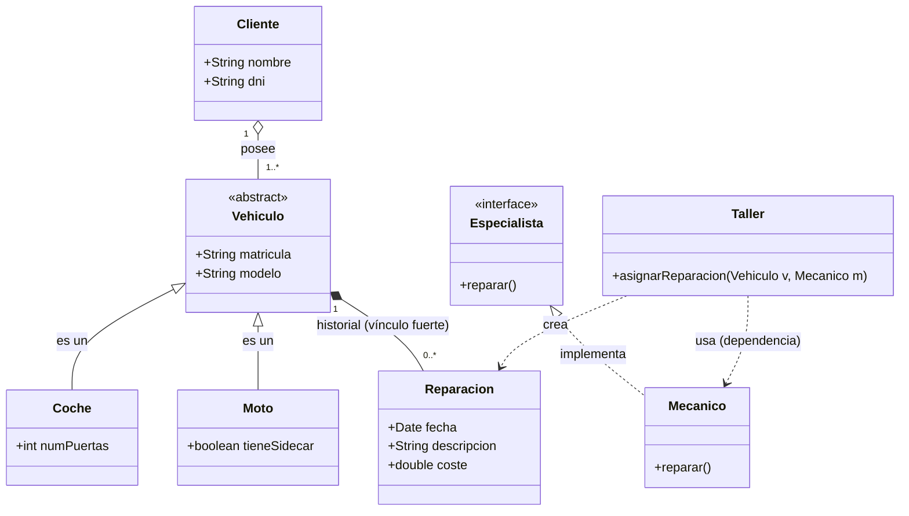

Herencia: Coche y Moto heredan la clase Vehículo, ya que, comparten atributos.

 Interfaz: Mecánico implementa Especialista, cumpliendo contrato del método reparar().

Agregación: La relación de Cliente y Vehículo es de agregación (rombo vacío), un cliente posee vehículos, pero estos tienen identidad propia, y podrían existir o pasar a otro dueño de forma independiente.

 Composición:La relación entre vehículo y reparación es de composición (rombo relleno) es un vínculo fortalecido, ya que, una reparación no tendría sentido sin un vehículo.

Dependencia: La clase Taller tiene una dependencia puntual con Mecánico al recibirlo como parámetro para realizar una acción, pero no la posee de forma permanente.
------------------------------------------------------------------------------------------------------------------------------------------------------------------------------------------------

COMPOSICIÓN ENTRE VEHÍCULO Y REPARACIÓN:

Una reparación no tiene sentido por sí misma; siempre se repara un vehículo. Si se elimina del Taller, su historial desaparece.
La clase vehículo se encarga de almacenar los objetos de la clase.
Seguridad de los datos: Al usar composición, te aseguras de que el historial no pueda ser manipulado o robado, por otro vehículo.

VENTAJAS DE USAR INTERFAZ ESPECIALISTA:

Desacoplamiento: el Taller no necesita conocer a la Persona, tan solo saber que es un Especialista capaz de reparar(). Esto permite cambiar un Mecanico por otro especialista, ya sea Robot, Socio... etc.
Polimorfismo: Al poder tener diferentes especialistas todos podrían pasar por el metodo de asignarReparacion, implementando siempre la interfaz.
Facilidad de pruebas testing: Facilita el testeo del Taller, sin tener que instanciar toda la lógica de un mecánico real.
